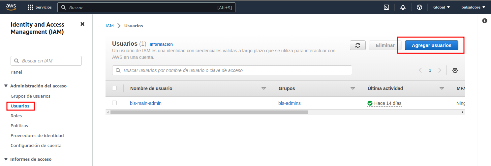
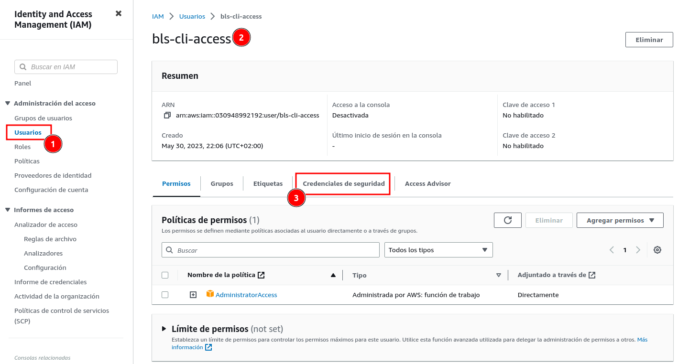
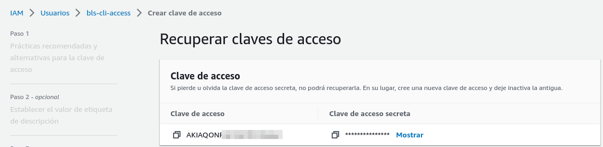
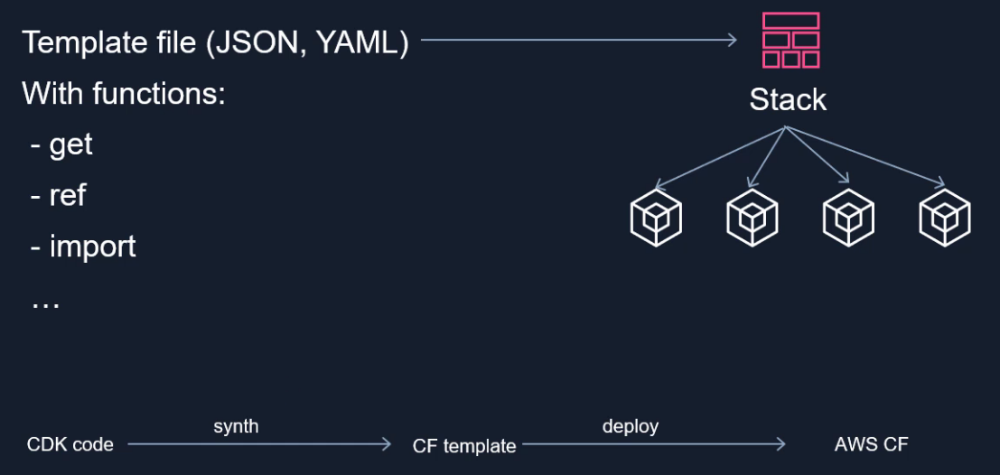
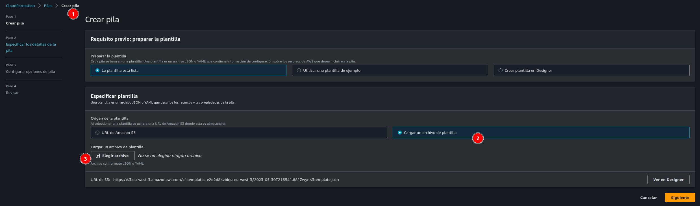
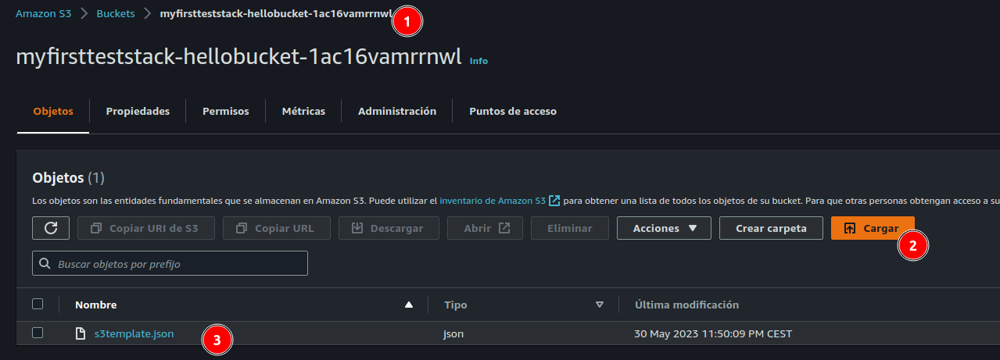

# AWS CDK Typescript

Infraestructura como código con aws cdk v2 + Typescript &amp; Jest (CloudFormation - Cognito - Lambda - Amplify)

# Creación de usuario de aws para CLI

Usaremos el servicio IAM con el que podremos crear un usuario de AWS que tenga permisos adecuados para utilizar la CLI.



Acceso a agregar usuario

Crearemos un usuario sin proporcionar acceso a la consola de administración de AWS. Una vez que hayamos creado el usuario, configuraremos sus permisos y le daremos el permiso de **AdministratorAccess**, ya que este usuario podrá desplegar todos los servicios necesarios.

## Configuración CLI

Instalación desde: [aws CLI](https://docs.aws.amazon.com/cli/latest/userguide/getting-started-install.html) 

```bash
❯ aws --version
aws-cli/2.11.23 Python/3.11.3 Linux/5.15.0-56-generic exe/x86_64.linuxmint.21 prompt/off
```

Una vez instalada la consola, iremos a **Credenciales de seguridad** > **Claves de acceso
[x] Interfaz de línea de comandos (CLI)**



Credenciales de seguridad



Una vez tengamos esta clave creada podemos ir a teminal para concluir con el proceso, ejemplo:

```bash
❯ aws configure
AWS Access Key ID [None]: AKKDUBALSDKFIYHUSDNFF
AWS Secret Access Key [None]: 8ijleiifa09ssadkflnmncdu79oksdfjpsii
Default region name [None]: eu-west-1
Default output format [None]: json
```

Para comprobar que tenemos el usuario bien configurado podemos ejecutar el comando `aws s3 ls`, que listará los buckets a los que tenemos acceso:

```bash
❯ aws s3 ls
2022-09-25 12:58:22 balslobre-nodejs-aws-s3
2023-02-13 22:49:30 cdk-hnb659fds-assets-030948992192-us-east-1
2023-02-18 23:44:12 mongodb-lambda-dev-serverlessdeploymentbucket-1xbtcie3ybgco
```

# AWS CDK & CloudFormation

## CloudFormation

Es el servicio con el que se trabajará como base en todo el curso, dado que CDK no es más que una abstracción por encima de CloudFormation. 

CloudFormation es un servicio de infraestructura como código que provee aws que organiza diferentes recursos de aws relacionados en stacks (pilas).



CDK to AWS CloudFormation

Tendremos el código escrito en cdk que transformaremos a una plantilla de CloudFormation mediante una función de synthesize.

Vamos a subir una plantilla de ejemplo para crear nuestro primer stack:



Primer simple stack

```json
{
  "Resources": {
    "HelloBucket": {
      "Type": "AWS::S3::Bucket",
      "Properties": {
        "LifecycleConfiguration": {
          "Rules": [
            {
              "ExpirationInDays": 3,
              "Status": "Enabled"
            }
          ]
        }
      }
    }
  }
}
```

Nombramos tras esto el nombre de nuestro stack **MiFirstTestStack** y esperamos a que se creen los recusos en este caso un bucket de s3



Creación de un bucket de s3 con CloudFormation subida de fichero

Si intentamos ahora borrar el stack no vamos a poder hacerlo porque para poderlo hacer tenemos que vaciar primero el bucket, es mucho más sencillo en aws crear que borrar. Si eliminamos el bucket como tal ya deberíamos poder borrar el stack.
